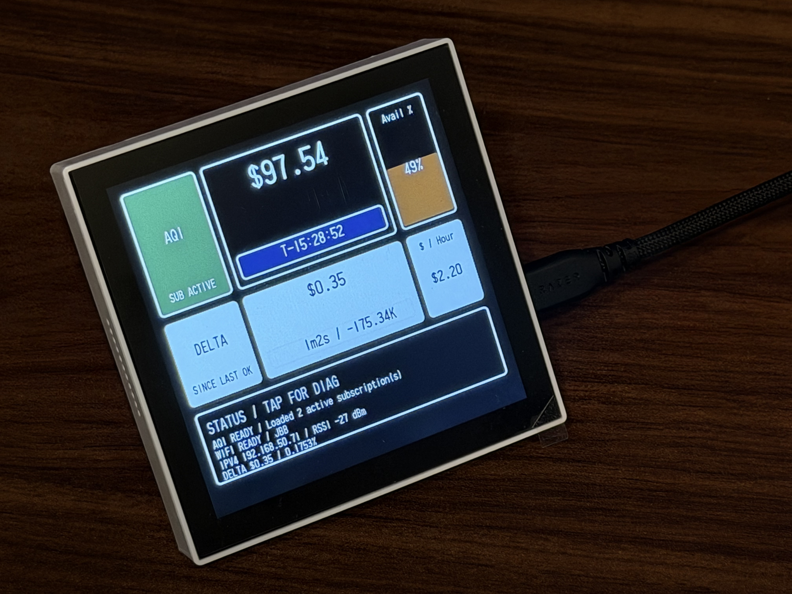

<!-- generated-by: gsd-doc-writer -->
# esp32_ai_monitor

基于 `ESP-IDF` 的 `ESP32-P4` 板上监控终端，面向 `Waveshare ESP32-P4-WIFI6-Touch-LCD-4B`，用于在设备侧提供本地仪表盘、配置入口、网络诊断和远端 provider 状态展示。



## 项目定位

- 板子负责 UI、触摸交互、联网、状态展示和少量控制动作
- 真正的 AI / 监控后端运行在 PC、本地服务器、NAS 或云端
- 当前主线是“板上监控屏 + 本地配置门户”，不是在板上直接跑重型 AI Agent

## 当前已实现能力

- 基于 `waveshare/esp32_p4_wifi6_touch_lcd_4b` 官方 BSP 启动显示链路
- 使用 `LVGL + TinyTTF` 渲染主监控屏
- 通过 `ESP-Hosted + esp_wifi_remote` 驱动 `ESP32-P4 + ESP32-C6` 的无线链路
- 提供统一运行时配置模型，支持：
  - Wi-Fi / 企业认证参数
  - 门户相关元数据
  - fallback 配置热点
  - provider 端点与凭据
  - UI / provider 刷新周期
- 提供板上本地配置网页和 REST 接口
- 轮询远端 provider，并在屏幕上展示余额、用量、delta 和状态文本

## 运行时架构

当前工作树的核心运行层次是：

1. 启动编排层：`main/main.c`
2. 配置中心层：`components/app_config_service`
3. 网络接入层：`components/network_service`
4. Provider 轮询层：`components/provider_service`
5. 本地交互层：
   - `components/ui_service`
   - `components/config_web_service`

当前 `app_main()` 的启动顺序是：

1. `wifi_info_screen_start()`
2. `network_service_start()`
3. `provider_service_start()`
4. `config_web_service_start()`

注意：UI 主实现文件已经切到 `components/ui_service/monitor_dashboard_screen.c`，但对外启动符号仍沿用 `wifi_info_screen_start()`。

## 目录结构

- `main/`
  - 应用入口与顶层组件依赖声明
- `components/app_config_service/`
  - 统一运行时配置模型、默认值装配、校验与 NVS 持久化
- `components/network_service/`
  - `STA`、企业认证、门户状态与 `SoftAP` 回退
- `components/provider_service/`
  - 外部 provider 轮询、状态快照、delta 与小时统计
- `components/config_web_service/`
  - 板上配置网页与本地 REST 接口
- `components/ui_service/`
  - `BSP + LVGL` 主监控屏
- `docs/`
  - 项目说明、架构、配置、开发、测试和 API 文档
- `.planning/`
  - 代码映射、研究记录与工程分析资料

## 安装与准备

### 依赖

- `ESP-IDF v6.0.1`
- `esp32p4` target
- 可用的 `idf.py`
- 一块 `Waveshare ESP32-P4-WIFI6-Touch-LCD-4B`

### 克隆仓库

```bash
git clone https://github.com/Minghou-Lei/esp32_ai_monitor.git
cd esp32_ai_monitor
```

### 最短启动路径

1. 确认当前会话已经能访问 `ESP-IDF MCP`
2. 检查 `project://config` 和 `project://status`
3. 在仓库根目录执行：

```powershell
idf.py reconfigure
```

4. 构建固件：

```powershell
idf.py build
```

5. 上板验证：

```powershell
idf.py -p <PORT> flash monitor
```

## 常用用法

### 1. 构建当前固件

```powershell
idf.py build
```

结果：生成 `build/esp32_ai_monitor.bin`，并可通过 `project://status` 查看最近一次构建状态。

### 2. 修改默认配置后重新生成工程

```powershell
idf.py reconfigure
```

结果：重新展开 `sdkconfig.defaults`、依赖和分区等构建态。

### 3. 烧录并观察板上行为

```powershell
idf.py -p <PORT> flash monitor
```

结果：验证主仪表盘、Wi-Fi 状态、provider 状态和本地配置接口是否按预期工作。

## 关键配置基线

当前仓库的硬约束包括：

- `target = esp32p4`
- `32MB flash`
- 自定义分区表 `partitions_32mb_singleapp.csv`
- `PSRAM`
- `LVGL + TinyTTF + CLIB malloc`
- `ESP-Hosted + esp_wifi_remote`

这些配置主要由 `sdkconfig.defaults` 表达，运行时覆盖由 `app_config_service` 写入 NVS。

## 敏感信息约定

当前项目已经涉及多类敏感字段，例如：

- Wi-Fi 密码
- 企业认证凭据
- 门户用户名 / 密码
- provider token
- provider 用户头值

因此：

- 不把实际值写入文档
- 不把本机敏感项复制进 `sdkconfig.defaults`
- 评审 `sdkconfig`、日志和配置网页返回值时优先检查是否泄露

## 相关文档

- [docs/GETTING-STARTED.md](./docs/GETTING-STARTED.md)
- [docs/ARCHITECTURE.md](./docs/ARCHITECTURE.md)
- [docs/API.md](./docs/API.md)
- [docs/CONFIGURATION.md](./docs/CONFIGURATION.md)
- [docs/DEVELOPMENT.md](./docs/DEVELOPMENT.md)
- [docs/TESTING.md](./docs/TESTING.md)
- [docs/ai-agent-monitor-proposal.md](./docs/ai-agent-monitor-proposal.md)
